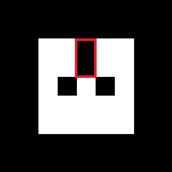
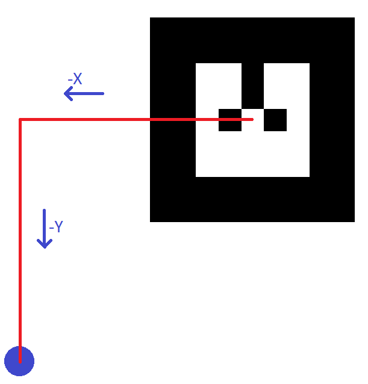

[](https://github.com/jeanpolochon/ar_track_alvar_bundles)

#  ar_track_alvar
Original package
- Package maintained by Scott Niekum
- sniekum@willowgarage.com
- sniekum@cs.umass.edu

Current package
- Package maintained by Guillaume Sarthou
- gsarthou@laas.fr

This repository is a fork from sniekum/ar_track_alvar. This repository offers two nodes to easily create tags.
This readme will only show how to use the new nodes, for more information on ar_track_alvar, see http://www.ros.org/wiki/ar_track_alvar.

## Tags preamble

### Convention
We always consider the orientation shown below as the reference orientation of the mark. You can distinguish this orientation with the two empty squares represented by the red box on this example.



When you create a new tag, an XML file will be generated with it. On this file you will find the description of the corners of each tag like this one:
```
    <corner x="-2" y="-2" z="0" />
    <corner x="2" y="-2" z="0" />
    <corner x="2" y="2" z="0" />
    <corner x="-2" y="2" z="0" />
```
If you want to manually modify this file, assume that the corners are as follows.


Finally, we will consider the following 3D marker for each tag.


### Identifiers
Each tags represents an identifier. In these nodes, the identifiers are numbers between 0 and 65535.
The identifiers used to create a tag will be specified in the name of the PNG, a generated XML file.
e.g :
For a flag :
```
MarkerData_0.png
MarkerData_0.xml
```
For a cube :
```
MarkerData_1_2_3_4_5_6.png
MarkerData_1_2_3_4_5_6.xml
```

## Flag generation
A tag called "flag," is a single 2D tag that refers to a position offset to its own.

### Usage
```
$ rosrun ar_track_alvar createFlag
```
First, enter the last ID you are using. The identifiers are chosen by you between 0 and 65535. Be careful, all the tags (flag or not), **must have a different identifier**, that is why the node automatically increases the identifiers of tags.

The reference unit use on this node is the centimeter.
After specifying the size of the tag, you can describe the position offset on X, Y, and Z.



### Tips
- Always take 1 cm margin on the size of your tag to keep a white border for better detection.
- Be carefull about the tag orientation

## Cube generation
A tag called "Cube" is composed of 6 tags assembled in a cube. Only the master tag will be displayed regardless of the orientation of the cube.

### Usage
```
$ rosrun ar_track_alvar createCube
```
First, enter the last ID you are using. The identifiers are chosen by you between 0 and 65535. Be careful, all the tags (flag or not), **must have a different identifier**, that is why the node automatically increases the identifiers of tags (**+6 per cube**). The master identifier will always be the first one present in the PNG and XML files name.

The reference unit use on this node is the centimeter.
After specifying the size of the tag, specified the size of the cube and ... this is all you need to do !!

The node will generate a pattern that you have to cut and stick.
### Tips
- Always take 1 cm margin on the size of your tag to keep a white border for better detection.
- If you have to cut all the tags of the pattern, make sure to stick them with the correct order and orientation.

## Map your identifiers

Ar_track_alvar_bundles (dependency) lets you map your objects with a textual name. In the case of multi-tag objects, only the master must be a link.

Fisrt, take the generated PNG and XML files and copy them to **ar_track_alvar_bundles / bundles /** and edit the **Map_ID_Name.txt** file.

It is on this file that you will map the identifiers with the textual name.
for example :
```
0 EXAMPLE_FLAG
1 EXAMPLE_CUBE
```
> Here, the EXAMPLE_CUBE is composed of 6 tags, but we only refer to the first

## Use your objects

The last step ! Once you have map your identifiers, edit the launch file **pr2_bundle_no_kinect.launch** in the ar_track_alvar package and specify the objects you want to use :
```
<arg name="bundle_files" default="
$(find ar_track_alvar_bundles)/bundles/MarkerData_0.xml
$(find ar_track_alvar_bundles)/bundles/MarkerData_1_2_3_4_5_6.xml
"/>
```

Now run the node :
```
$ roslaunch ar_track_alvar pr2_bundle_no_kinect.launch
```

And enjoy !!!

> the launch file is create for PR2 but you can change the **cam_image_topic** and **cam_info_topic** to adapte it for an other support
> If you have any probleme with rviz, change **output_frame**

## Option

For flags and cubes, you can add color. Six colors are available in addition to black !!


