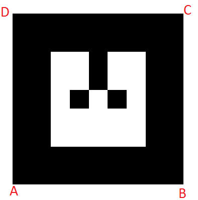
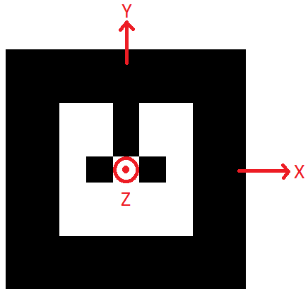
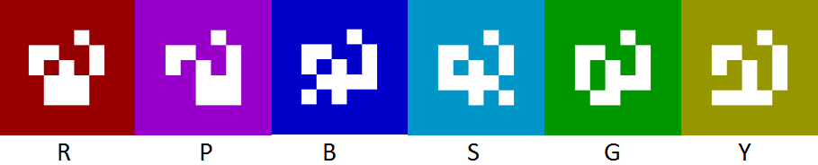

#  Marker creation


## Tags preamble

### Convention
We always consider the orientation shown below as the reference orientation of the mark. You can distinguish this orientation with the two empty squares represented by the red box on this example.


When you create a new tag, an XML file will be generated with it. On this file you will find the description of the corners of each tag like this one:
```
    <corner x="-2" y="-2" z="0" />
    <corner x="2" y="-2" z="0" />
    <corner x="2" y="2" z="0" />
    <corner x="-2" y="2" z="0" />
```
If you want to manually modify this file, assume that the corners are as follows.



Finally, we will consider the following 3D marker for each tag.



### Identifiers
Each tags represents an identifier. In these nodes, the identifiers are numbers between 0 and 65535.
The identifiers used to create a tag will be specified in the name of the PNG, a generated XML file.

e.g :    
For a single marker :    
```
MarkerData_0.png
MarkerData_0.xml
```
For a cube :
```
MarkerData_1_2_3_4_5_6.png
MarkerData_1_2_3_4_5_6.xml
```

## Deported marker generation
A tag called "Deported marker" is a single 2D marker that refers to a position offset to its own.

### Usage
```
$ rosrun ar_track_alvar createDeportedMarker
```
First, enter the ID you want to use. The identifiers are chosen by you between 0 and 65535. Be careful, all the tags (deported or not), **must have a different identifier**, that is why the node can automatically increases the identifiers of tags.

The reference unit use on this node is the centimeter but you can change it with option '-u'.
After specifying the size of the tag, you can describe the position offset on X, Y, and Z.


### Tips
- Always take 1 cm margin on the size of your tag to keep a white border for better detection.
- Be carefull about the tag orientation

## Cube generation
A tag called "Cube" is composed of 6 tags assembled in a cube. Only the master tag will be displayed regardless of the orientation of the cube.

### Usage
```
$ rosrun ar_track_alvar createCube
```
First, enter the ID you want to use. The identifiers are chosen by you between 0 and 65535. Be careful, all the tags (deported or not), **must have a different identifier**, that is why the node can automatically increases the identifiers of tags (**+6 per cube**). The master identifier will always be the first one present in the PNG and XML files name.

The reference unit use on this node is the centimeter but you can change it with option '-u'.
After specifying the size of the tag, specified the size of the cube and ... this is all you need to do !!

The node will generate a pattern that you have to cut and stick.
 :exclamation: Once the PNG is printed, do not cut all markers independently, but only the entire pattern.

### Tips
- Always take 1 cm margin on the size of your tag to keep a white border for better detection.
- If you have to cut all the tags of the pattern, make sure to stick them with the correct order and orientation.

## Colors

For deported markers and cubes, you can add color. Six colors are available in addition to black !!



## Options

Several options can be added when you run the generators.

### For deported markers

 - **65535**                    marker with number 65535
 - **-1 \"hello world\"**       marker with string
 - **-2 catalog.xml**           marker with file reference
 - **-3 http://wiki.ros.org**   marker with URL
 - **-u 96**                    use units corresponding to 1.0 unit per 96 pixels
 - **-uin**                     use inches as units (assuming 96 dpi)
 - **-ucm**                     use cm's as units (assuming 96 dpi) <default>
 - **-s 5.0**                   use marker size 5.0x5.0 units (default 9.0x9.0)
 - **-r 5**                     marker content resolution -- 0 uses default
 - **-m 2.0**                   marker margin resolution -- 0 uses default
 - **-p**                     prompt marker placements interactively from the user
 - **-c B**                    marker color :  B:blue R:red G:green P:pink S:sky Y:yellow -- default black

### For cubes

 - **65535**                    marker with number 65535
 - **-u 96**                    use units corresponding to 1.0 unit per 96 pixels
 - **-uin**                     use inches as units (assuming 96 dpi)
 - **-ucm**                     use cm's as units (assuming 96 dpi) <default>
 - **-sm 5.0**                  use marker size 5.0x5.0 units (default 9.0x9.0)
 - **-sc 5.0**                  use cube size 5.0x5.0 units (default 9.0x9.0)
 - **-r 5**                     marker content resolution -- 0 uses default
 - **-m 1.0**                   marker margin resolution -- 0 uses default
 - **-p**                       prompt marker placements interactively from the user
 - **-c B**                     cube color :  B:blue R:red G:green P:pink S:sky Y:yellow -- default black
